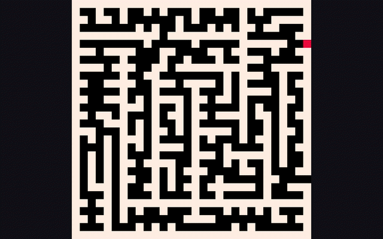

<p align="center">
  
</p>

# Maze Runner

Maze Runner is an arcade maze game written in Python using [pyxel](https://github.com/kitao/pyxel). It is based on an algorithm I wrote for a Google interview question.

> How would you randomly generate a maze?

## Build and Play

```
git clone git@github.com:balloonio/maze-runner.git
cd maze-runner
python3 -m venv myvenv
source myvenv/bin/activate
pip3 install -r requirements.txt
./maze_runner.py
```

## Controls and Keys

| Control         | Key                            |
|-----------------|--------------------------------|
| Move up         | `UP arrow key` or `W`          |
| Move down       | `DOWN arrow key` or `S`        |
| Move left       | `LEFT arrow key` or `A`        |
| Move right      | `RIGHT arrow key` or `D`       |
| Restart         | `G`                            |
| Quit            | `ESC`                          |

## Features

- Maze is randomly generated for each level.
- Maze entrance and exit are randomly generated as well for each level.
- Maze is guaranteed to have one and only path.
- Sound effect is played when player reaches the exit in each level.
